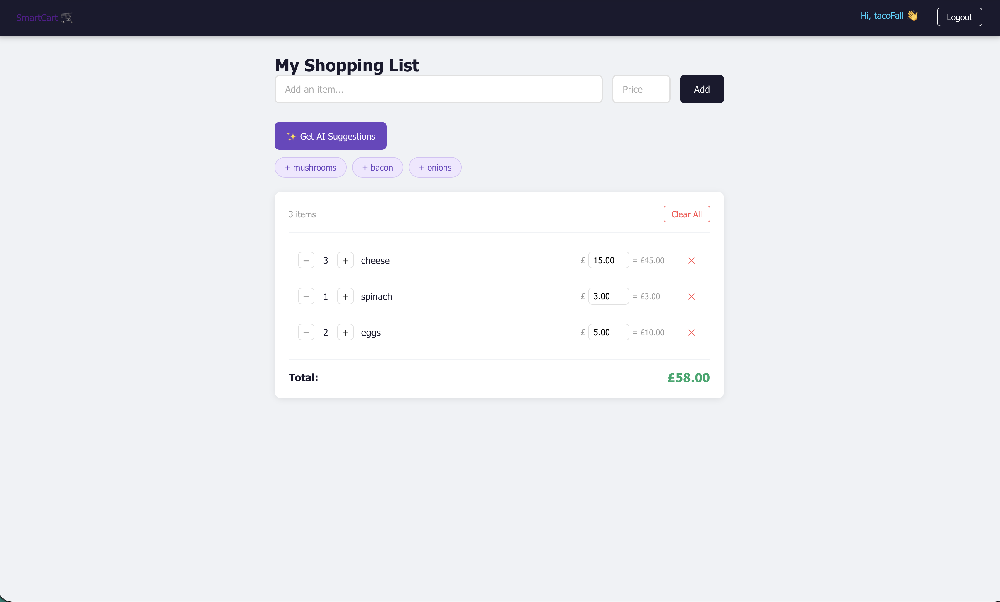
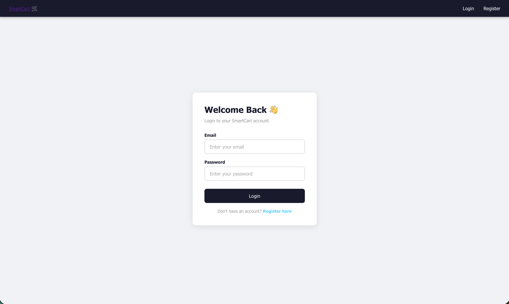

# SmartCart 🛒

A full-stack, AI-powered shopping list app built with React and Spring Boot. Users can create an account, build a shopping list, track prices with live running totals, and get AI-generated product suggestions based on what's already in their cart.

---

## ✨ Features

- **User authentication** — secure registration and login with JWT tokens and BCrypt password hashing
- **Personal shopping lists** — every user has their own private list, enforced via a one-to-many database relationship
- **Full CRUD** — add, edit, delete, and clear shopping items
- **Live quantity & price tracking** — adjust quantity with +/- controls, edit prices inline, and see subtotals and a running total update instantly
- **AI-powered suggestions** — integrates with the Gemini API to suggest complementary items based on your current list, with one-click add
- **Protected routes** — unauthenticated users are automatically redirected to login

---

## 🛠️ Tech Stack

**Frontend**
- React (functional components, hooks)
- React Router
- Vanilla CSS

**Backend**
- Java 21 + Spring Boot
- Spring Security + JWT (io.jsonwebtoken)
- Spring Data JPA / Hibernate

**Database**
- PostgreSQL

**AI**
- Google Gemini API

---

## 🏗️ Architecture

```
React (localhost:3000)
   │  fetch + JWT bearer token
   ▼
Spring Boot REST API (localhost:8080)
   │  Spring Data JPA
   ▼
PostgreSQL
   │
   └── Gemini API (AI suggestions)
```

- `AuthController` — registration and login, returns a signed JWT
- `ShoppingItemController` — CRUD endpoints for items, scoped to the authenticated user via the JWT
- `GeminiService` — calls the Gemini API with the user's current list and parses suggested items
- `User` ⟷ `Item` — one-to-many relationship (`@ManyToOne` / `@JoinColumn`) so each item is tied to its owner

---

## 📸 Screenshots

**Shopping list with AI suggestions, quantity controls, and live price totals**


**Login**


**Register**


---

## 🚀 Getting Started

### Prerequisites
- Node.js
- Java 21
- PostgreSQL
- A Gemini API key ([aistudio.google.com](https://aistudio.google.com))

### Backend setup
```bash
cd backend
# add your DB credentials and Gemini API key to src/main/resources/application.properties
./mvnw spring-boot:run
```

### Frontend setup
```bash
cd frontend
npm install
npm start
```

The app will be available at `http://localhost:3000`, with the API running on `http://localhost:8080`.

---

## 🗺️ Roadmap

- [ ] Deploy backend (AWS EC2/RDS) and frontend (Vercel)
- [ ] Swap Gemini for Claude API
- [ ] Add automated tests
- [ ] Persistent, environment-based JWT secret key

---

## 📚 What I Learned

I started this project with zero React or Spring Boot experience, so most of what's below came from actually breaking things and figuring out why.

- **React fundamentals** — state, props, hooks, and React Router, learned by building the shopping list, auth pages, and protected routes from scratch
- **REST APIs in Spring Boot** — full CRUD, plus the difference between GET/POST/PUT and how `@RequestBody`/`@ResponseBody` convert between JSON and Java objects
- **Relational data** — modeling a one-to-many relationship between `User` and `Item` with `@ManyToOne`/`@JoinColumn`, and why the foreign key lives on the "many" side
- **JWT auth** — building register/login endpoints with BCrypt password hashing, and *why* my tokens kept breaking every time I restarted the backend (the signing key was being regenerated randomly on every startup — fixed it by loading a fixed key from a config value instead)
- **CORS in practice** — chased down a 403 on preflight `OPTIONS` requests that curl couldn't reproduce but the browser could, which turned out to be Spring Security blocking the preflight before it ever reached my CORS config
- **`int` vs `Integer`** — spent a good hour confused why partial PUT updates (e.g. updating only price) kept throwing `Cannot map null into type int`, before realizing primitives can never be null and Entity fields need wrapper types
- **Integrating a third-party API** — calling the Gemini API from a Spring service class, keeping the API key out of git with `.gitignore`, and parsing the AI's response back into usable suggestions on the frontend
- **Reading stack traces properly** — the biggest overall lesson was learning to actually read the full error (Spring Boot's, Postgres's, or the browser console's) instead of guessing, since almost every bug above was solvable once I found the *right* line in a wall of logs

---

## 👤 Author

**Lopsang** — [github.com/LopsangT](https://github.com/LopsangT)
